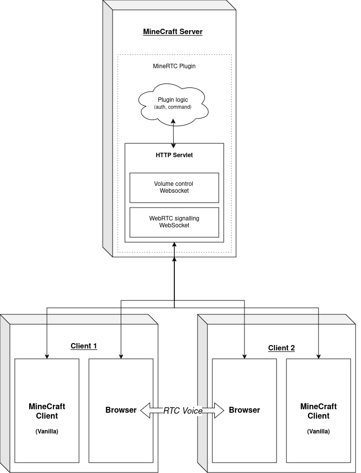

# MineRTC

Vanilla proximity chat!

## Description

MineRTC allows for Vanilla clients to talk to each other through proximity chat using their browsers.
This is done through WebRTC connections and WebSockets.

This plugin is compatible with Bukkit-based servers (Bukkit, Spigot, Paper).

**MineCraft version ports are currently *WIP*.**

## Usage
### Server
1. Place the latest jar in your plugins folder
2. Start your Bukkit-based server
3. **Configure** your server IP and port in `plugins/MineRTC/config.yml`
4. Re-start your server

*Note: Using port 443 (or 80) requires the server be started with root permissions.*

### In game

1. Type `/connect` and open the provided link in your browser
2. On the warning page, click on `Advanced -> proceed to [server ip]`
3. Allow for audio input
4. Chat with your friends!

#### Why the security warning?

Modern browsers do not allow for voice and video media to be used on non-HTTPS websites. 
This is remedied by mimicking HTTPS with a fake (self-signed) SSL certificate that is the same for all servers,
hence triggering the SSL certificate warning.

## Building

1. Run `./gradlew build` (Linux and macOS) or `./gradlew.bat build` (Windows)
2. The plugin jar will be in `build/libs`

## How it works

MineRTC works by creating a Jetty HTTP server "within" the MineCraft server.
Within this HTTP server are a file server and two WebSocket endpoints:
 - A first to which clients connect to in order to establish voice calls (via WebRTC)
 - Another that periodically sends volume control data to all clients.

The plugin also includes basic authentication to prevent hijackings.

